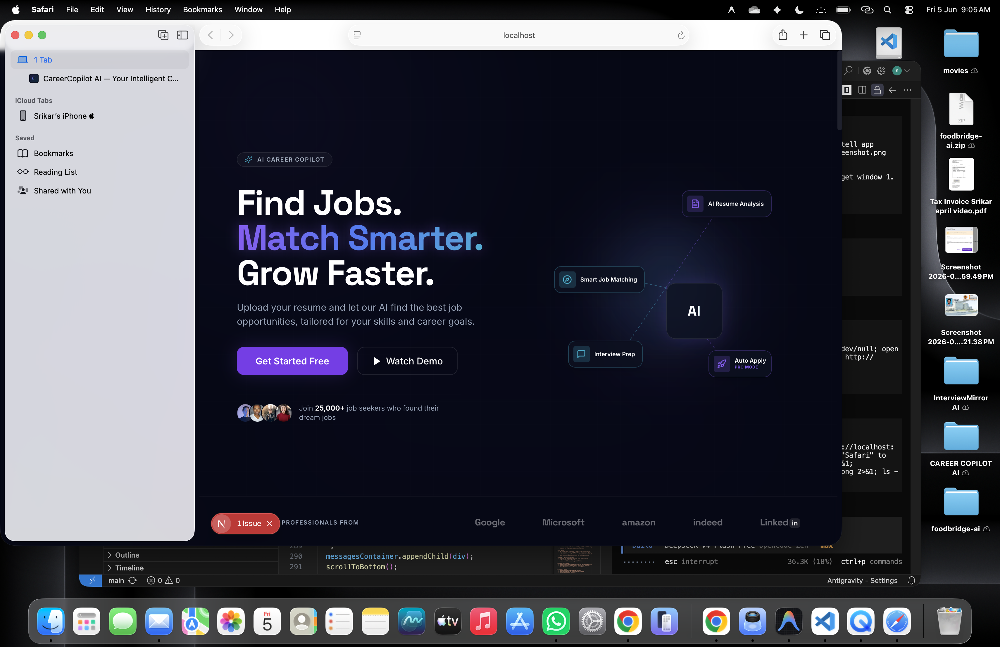

# PromptCompiler V2



Transform any project idea into three production-grade AI prompts — **Plan · Build · Optimize**.

PromptCompiler is a ChatGPT-style web interface that converts rough project descriptions into structured, actionable prompt blueprints for AI coding assistants like Claude, ChatGPT, Gemini, Grok, and Cursor.

## Features

- **Three-Prompt Pipeline** — Every idea becomes a Planning & Architecture prompt, an Implementation prompt, and a Review & Optimization prompt.
- **Smart Domain Detection** — Automatically identifies your project domain (Full Stack, AI/ML, SaaS, DevOps, Mobile, etc.) and tailors output.
- **Multi-Depth Support** — Choose from Standard, Detailed, or Expert-level prompt generation depth.
- **Target AI Selection** — Optimize prompts for specific AI models or keep them model-agnostic.
- **Expandable Cards** — Each prompt card is collapsible/expandable with one-click copy.
- **Copy All** — Copy all three prompts at once, formatted and ready to paste.
- **Regenerate** — Quickly re-roll prompts or edit your input and recompile.
- **Compilation History** — Past compilations are saved locally to your browser.
- **Mobile Responsive** — Fully functional on mobile with a slide-out sidebar.

## How It Works

1. **Describe your idea** — Type or paste a project description (e.g., "Build a full-stack SaaS analytics dashboard with Next.js, Supabase, and Stripe").
2. **Configure options** — Select output depth, target domain, and target AI model.
3. **Compile** — Press Enter or click the send button.
4. **Use the prompts** — Copy individual cards or all three at once, then paste into your AI coding tool of choice.

## Tech Stack

- **HTML5** — Semantic markup with accessibility attributes
- **CSS3** — Custom properties, dark theme, responsive design, animations
- **JavaScript (ES6+)** — Vanilla JS, no frameworks, localStorage for history
- **Google Fonts** — Inter (UI), JetBrains Mono (code display)

## Getting Started

### Local Usage

Simply open `index.html` in any modern browser — no build step or server required.

```bash
git clone https://github.com/Srikar-Merugu/PromptCompiler.git
cd PromptCompiler
open index.html
```

Or serve with a local HTTP server for best results:

```bash
python3 -m http.server 3000
open http://localhost:3000
```

### Deployment

Deploy instantly to any static hosting provider — Vercel, Netlify, GitHub Pages, or Cloudflare Pages.

## Prompt Output Structure

| Prompt | Focus | Content |
|--------|-------|---------|
| **01 — Plan** | Planning & Architecture | Requirements, system architecture, tech stack, database design, API design, folder structure, roadmap, security, scalability |
| **02 — Build** | Implementation | Complete code scaffolding, backend/frontend code, auth flows, database schemas, third-party integrations, tests |
| **03 — Optimize** | Review & Hardening | Code quality audit, security review, performance analysis, bug detection, refactoring, test coverage, CI/CD, monitoring, production scorecard |

## Supported AI Targets

- Claude · ChatGPT · Gemini · Grok · Cursor
- **All Models** — produces model-agnostic prompts

## License

[MIT](LICENSE)
